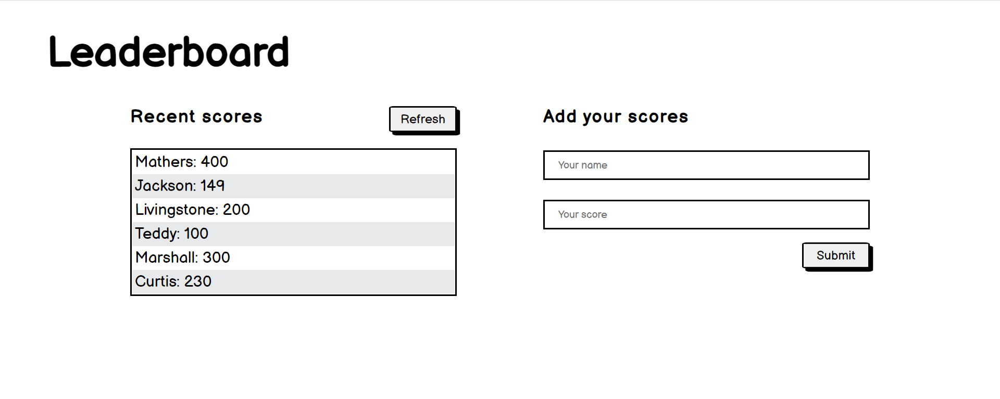

# Leaderboard

> This project is called leaderboard. It displays scores submitted by different players. It also allows you to submit your score. All data is preserved thanks to the external Leaderboard API service.

## Built With

- HTML, CSS and JavaScript
- Webpack

## Getting Started

### Setup

#### To get a local copy up and running follow these simple example steps.

- Click the green `Code` button on the repo
- In your local PC, open your terminal in the folder you would like to clone the project.
- Clone the repo with the command: `git clone (copied link)`; like so: `git clone https://github.com/TedLivist/leaderboard.git`
- On the terminal, navigate into the directory like so: `cd leaderboard`
- Checkout to branch name like so: `git checkout [branch name]`
- Run `npm i` to install the dependencies
- Run `npm start` to start the application

### Usage
- Type in name and score in the corresponding inputs and click the `Submit` button. Do this as many times as you wish - once, twice, (thrice?)
- To get the list of the name-score pairs, click the `Refresh` and the list of the inputs you have submitted will be rendered

## Author

👤 **Teddy-Livingstone**

- [GitHub](https://github.com/TedLivist)
- [LinkedIn](https://linkedin.com/in/tememandu)

## 🤝 Contributing

Contributions, issues, and feature requests are welcome!

Feel free to check the [issues page](../../issues/).

## Show your support

Give a ⭐️ if you like this project!

## Acknowledgments

- Hat tip to anyone whose code was used
- Inspiration
- etc